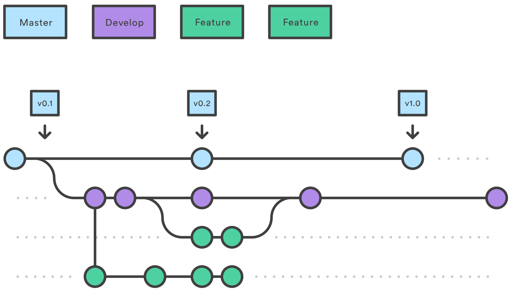

# Git Feature Branch workflow
Source [Atlassian](https://www.atlassian.com/git/tutorials/comparing-workflows/feature-branch-workflow)  

# How it works
The Feature Branch Workflow assumes a central repository, and master represents the official project history. Instead of committing directly on their local master branch, developers create a new branch every time they start work on a new feature. __Feature branches should have descriptive names, like animated-menu-items or issue-#1061__. The idea is to give a clear, highly-focused purpose to each branch. Git makes no technical distinction between the master branch and feature branches, so developers can edit, stage, and commit changes to a feature branch.  

## Advantages
- The `master` branch will never contain broken code.__
- Encapsulating feature development also makes it possible to leverage pull requests, which are a way to initiate discussions around a branch. You can open a pull request asking for suggestions from your colleagues. 

# Walkthrough
## Create a new-branch on your machine
Use a separate branch for each feature or issue you work on. After creating a branch, check it out locally so that any changes you make will be on that branch.  
`git checkout -b new-feature` or `git checkout -b issue-001`

## Work, add and commit
On this branch, edit, stage (command add) and commit changes that you make to your code.  
1. `git status` (to check the local changes)
2. `git add Snakefile` (if you made changes to the Snakefile that you would like to stage)
3. `git add Snakefile` (you continued working on the Snakefile
4. `git commit -m "fixed bugs and implemented the new feature" Snakefile`

## Push feature branch to remote 
It’s a good idea to push the feature branch up to the central repository ("KoesGroup/repository-name"). This serves as a convenient backup, when collaborating with other developers, this would give them access to view commits to the new branch.  
`git push -u origin new-feature` or `git push -u origin issue-001` (creates a branch on the central Github repository).  

To get feedback on the new feature branch, create a pull request on Github. You can add reviewers and make sure everything is good to go before merging.

## Resolve feedback
Now teammates comment and approve the pushed commits. Resolve their comments locally, commit, and push the suggested changes to Github. Your updates appear in the pull request.

## Merge your pull request
Before you merge, you may have to resolve merge conflicts if others have made changes to the repo. When your pull request is approved and conflict-free, you can add your code to the master branch. 

# A working illustrated example
See the [Atlassian example here](https://www.atlassian.com/git/tutorials/comparing-workflows/feature-branch-workflow) 
